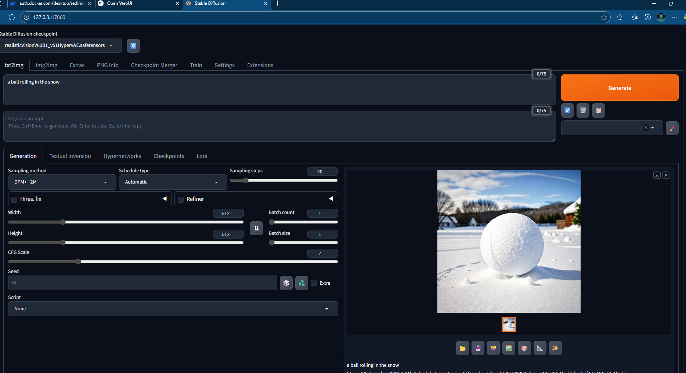
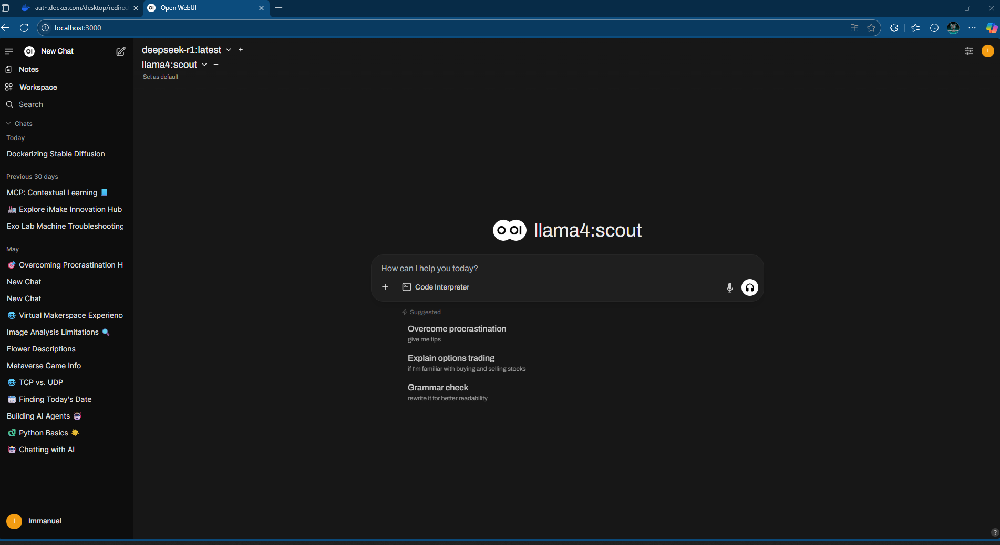
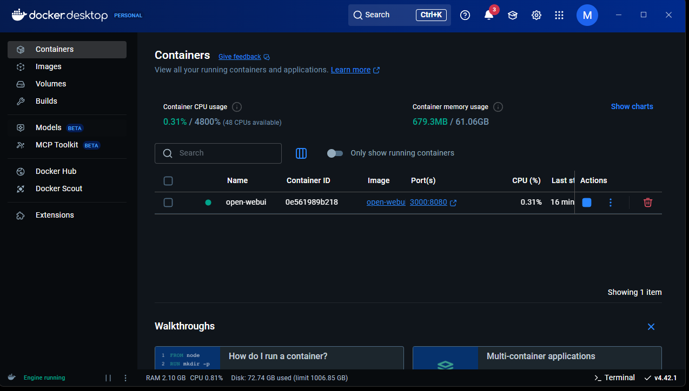
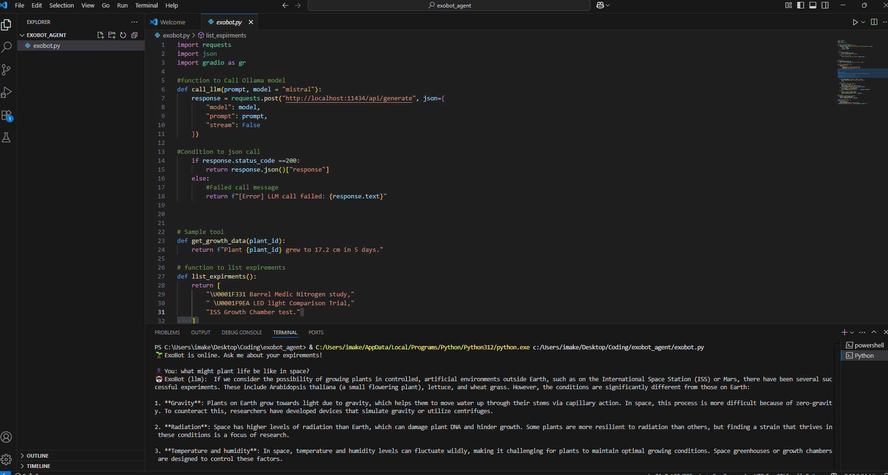

# 🧠 AI Agent Toolkit with Docker: Stable Diffusion + LLM (LLaMA 4) + ExoBot

## Overview

This project demonstrates a fully containerized AI setup that integrates:
- 🖼️ Stable Diffusion (via Automatic1111 WebUI) for image generation
- 💬 Large Language Models (LLaMA 4 / DeepSeek) running locally via Ollama
- 🤖 A custom Python-based agent, *ExoBot*, used for contextual learning (e.g., plant growth experiments)
- 🐳 Docker orchestration for isolated development and deployment

Built as part of my work at a college Makerspace, this project explores real-world applications of local generative AI, including education, automation, and visual creativity.

---

## 🛠️ Tech Stack

| Component | Purpose |
|----------|---------|
| **Docker / Docker Desktop** | Containerized environment for reproducibility |
| **Stable Diffusion (A1111)** | Local image generation via text prompts |
| **Ollama** | Local LLM server (supports models like LLaMA 3/4, Mistral, DeepSeek) |
| **Python + Gradio** | Custom interface and tools for LLM integration |
| **VS Code** | IDE for developing agent scripts |
| **NVIDIA GPU Acceleration** | High-performance AI execution (image + text) |

---

## 🧪 Features Demonstrated

- 📷 **Image Generation:** Prompt-based visual output using A1111 interface.
  - Example: *"A ball rolling in the snow"*
- 🧠 **LLM Agent Interface:** Local chat UI using Ollama, integrating LLaMA 4 and DeepSeek.
- 🧬 **ExoBot Educational Agent:** Responds to questions about experiments, integrates real-world data with AI-generated explanations.
- 💻 **Dockerized Execution:** Launches and isolates the environment for quick start and teardown.

---

## 📸 Screenshots

| Stable Diffusion (A1111) | Ollama Chat UI | Docker Dashboard | ExoBot Agent in Python |
|--------------------------|----------------|------------------|------------------------|
| |  |  |  

---

## 🚀 How to Run Locally

### Prerequisites:
- Docker Desktop (with NVIDIA GPU support enabled)
- Python 3.10+
- Optional: VS Code

### 1. Clone the repository:
```bash
git clone https://github.com/your-username/ai-agent-toolkit.git
cd ai-agent-toolkit
```

### 2. Start the Docker containers:
```bash
docker compose up
```

### 3. Open the UIs:
- A1111 WebUI: [http://localhost:7860](http://localhost:7860)
- Ollama Chat: [http://localhost:3000](http://localhost:3000)

---

## 🧩 Future Enhancements

- Add voice input/output
- Expand agent’s contextual learning abilities
- Include real-time sensor feedback from IoT/experiments

---

## 👋 About Me

I'm a Computer Science student with a VFX background and a deep interest in AI, automation, and creative tools. This project merges my technical and artistic passions while contributing to hands-on learning experiences for others.

